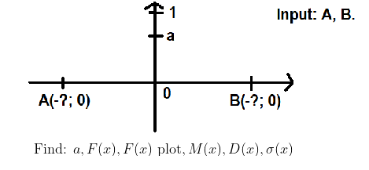
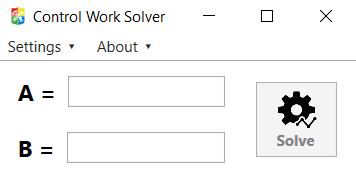

<h1 align="center">Statistics Control Work (CW)</h1>

**Project on the subject "Probability theory, probabilistic processes and mathematical statistics"**, 4th semester<br>


**Using this repo you agree not to violate the rules of academic integrity.**
Not for commercial use.

<h2>Tech stack:</h2>

- **C#**
- **.NET 9**
- PDF Processing: **[QuestPDF](https://www.nuget.org/packages/QuestPDF)**
- Calculations: **[Wolfram Alpha API](https://products.wolframalpha.com/api/)**
- Wolfram Alpha API Library: **[Genbox.WolframAlpha](https://github.com/Genbox/WolframAlpha)**
- LaTeX Rendering: **[ForNeVeR.WpfMath](https://github.com/ForNeVeR/xaml-math)**

<h2>Task</h2>


<h2>How to install</h2>

1. Download `Release.zip` from `latest` release.
2. Open `StatisticsCW.exe`
3. 🎉

<h2>How to use</h2>

User interface is **intuitive**:<br><br>
<br><br>

But you have to register on [Wolfram Alpha API Portal](https://products.wolframalpha.com/api/) and obtain AppId.<br>
After that, you need to save it in the appropriate field in the settings.

<h2>Requirements</h2>
<h3>For use:</h3>

- Wolfram Alpha API AppId
- Win-x64 Platform

<h3>For development</h3>

- **.NET 9 SDK**

<h2>Contributions</h2>

**Contributions are welcome!** 🎉

It's better to create an issue with description of your **bug/feature** before creating pull requests.

<h3>About branching</h3>

This project uses **TBD git strategy**.

Each contributor should have a branch. **Naming example:** ```feat/<nickname>```